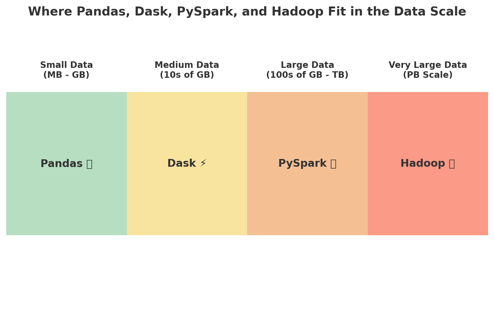

# **Lab 01 - Getting Started with PySpark** 

---

# What is PySpark?

**PySpark** is the **Python API for Apache Spark**.

* Apache Spark itself is a **fast, distributed, in-memory data processing engine** written in Scala.
* PySpark allows you to write Spark applications using **Python** instead of Scala or Java.
* It integrates with Python libraries like **pandas, NumPy, scikit-learn**, making it easy for data engineers and data scientists to work with big data.

---

# Important Features of PySpark

1. **Unified Analytics Engine**

   * Works with batch, streaming, machine learning, and graph processing in one framework.

2. **Ease of Use**

   * Write Spark jobs using Python instead of complex Scala/Java.
   * Similar APIs to pandas and SQL (DataFrames, Spark SQL).

3. **Distributed Computing**

   * Automatically distributes large datasets and computations across a cluster.
   * Fault-tolerant using RDD (Resilient Distributed Dataset).

4. **Integration with Big Data Ecosystem**

   * Works with Hadoop, Hive, HDFS, Cassandra, HBase, S3, Azure Blob, etc.

5. **Machine Learning Support (MLlib)**

   * Provides scalable algorithms for classification, regression, clustering, recommendation.

6. **Real-Time Processing (Spark Streaming / Structured Streaming)**

   * Handle streams of data in near real-time (Kafka, Flume, sockets, etc.).

7. **High Performance**

   * Uses **in-memory computation** → faster than Hadoop MapReduce.

---

# Common Use Cases of PySpark

1. **Data Processing & ETL**

   * Clean, transform, and join terabytes of structured/unstructured data.
   * Example: Load data from S3, transform with PySpark, save to a data warehouse (Snowflake/Redshift).

2. **Real-Time Analytics**

   * Stream processing with Spark Structured Streaming.
   * Example: Fraud detection from Kafka streams in milliseconds.

3. **Machine Learning at Scale**

   * Use MLlib for training models on massive datasets.
   * Example: Recommender systems (Netflix, Amazon).

4. **Data Exploration & BI**

   * Query data using **Spark SQL** with a Python interface.
   * Example: Running SQL-like queries on petabytes of data in a data lake.

5. **Graph Processing**

   * Use GraphX (through PySpark) for social network analysis, recommendation engines, etc.

---

In short: **PySpark = Big Data + Pythonic Simplicity + Spark Power**.

---

#  Comparison: PySpark vs Pandas vs Dask vs Hadoop

| Feature / Tool        | **PySpark**                            | **Pandas**                                  | **Dask**                                 | **Hadoop (MapReduce)**              |
| --------------------- | ---------------------------------------- | --------------------------------------------- | ----------------------------------------- | ------------------------------------- |
| **Language**          | Python API for Apache Spark              | Python                                        | Python (parallel computing)               | Java-based                            |
| **Scale**             | Very Large (GB → TB → PB)                | Small (MB → Few GB)                           | Medium to Large (GB → TB)                 | Very Large (TB → PB)                  |
| **Execution Model**   | Distributed, In-Memory                   | In-Memory (Single Machine)                    | Distributed, Lazy Evaluation              | Disk-Based, Batch Processing          |
| **Speed**             | High (in-memory, parallel)               | Fast for small data, poor scaling             | Faster than Pandas, scales horizontally   | Slower (writes to disk between steps) |
| **Ease of Use**       | Medium (requires Spark setup)            | Very Easy                                     | Easy for Pandas users                     | Complex (low-level coding)            |
| **Data Sources**      | CSV, JSON, Parquet, Hive, HDFS, S3, etc. | Local files (CSV, Excel, JSON)                | CSV, Parquet, HDFS, S3                    | HDFS (Hadoop FS)                      |
| **SQL Support**       | Yes (Spark SQL)                          | No (only DataFrame ops)                       | No (but works with SQLAlchemy connectors) | Yes (via Hive/Pig integration)        |
| **Machine Learning**  | Yes (MLlib)                              | No (relies on scikit-learn, TensorFlow, etc.) | Limited (via scikit-learn integration)    | No (needs Mahout, Spark ML, etc.)     |
| **Streaming Support** | Yes (Structured Streaming)               | No                                            | Limited (with custom solutions)           | No (batch-only)                       |
| **Best Use Case**     | Big Data ETL, Analytics, ML              | Small-scale data analysis                     | Medium data scaling from Pandas           | Large-scale batch data processing     |

---

##  Visual Overview  

The diagram below shows **where each tool fits** on the data scale:  

---

## Key Takeaways  
- **Pandas** → Best for **small datasets** that fit into memory.  
- **Dask** → Extends Pandas for **medium-scale distributed data**.  
- **PySpark** → Best for **enterprise-scale big data analytics, ETL, ML, and streaming**.  
- **Hadoop (MapReduce)** → Reliable for **large-scale batch processing**, but slower compared to Spark.  

